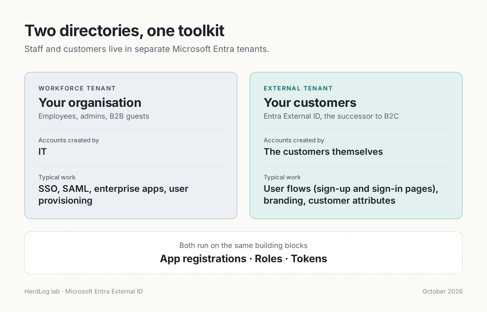
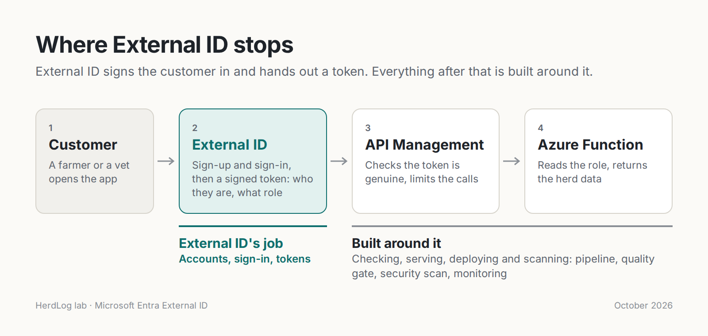
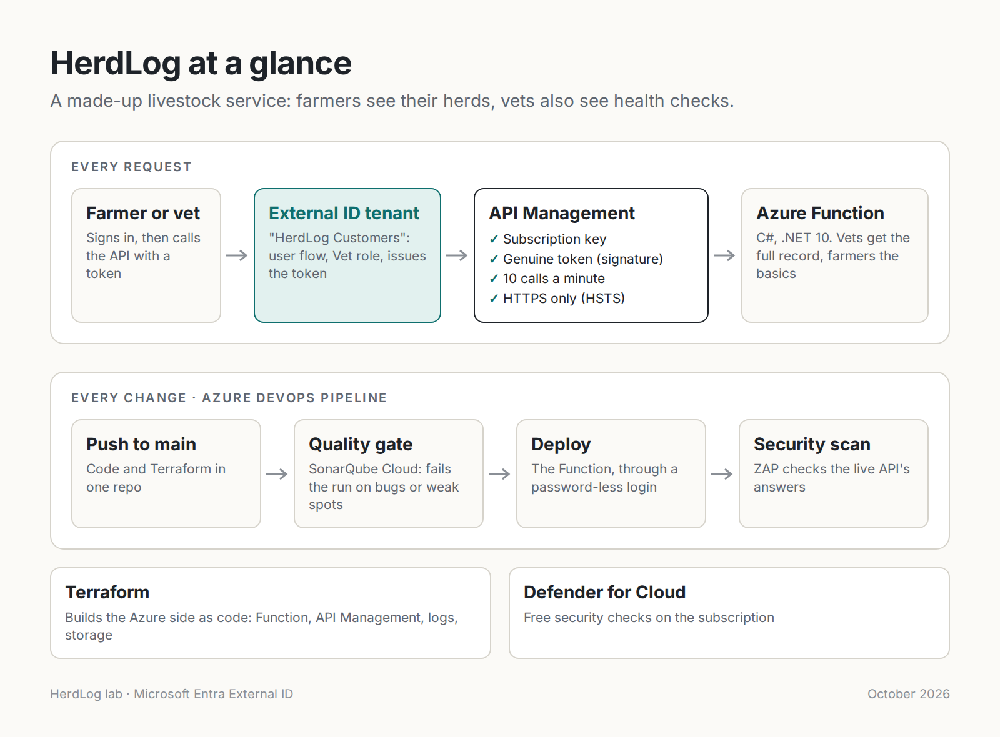

# Proof of Concept: Customer Identity with Microsoft Entra External ID (HerdLog)

**Author:** Tsvetoslav Shalev
**Date:** 2026-10-01
**Status:** `Completed`
**Repository:** [`herdlog/`](../herdlog/)

---

## Problem Statement

Azure AD B2C (now Microsoft Entra External ID) came up repeatedly in recent job
applications. My identity experience is on the workforce side: enterprise
applications, SSO, SAML, certificates and user provisioning for staff. Customer
identity (CIAM) works from the same building blocks but for a different audience:
customers who create their own accounts, in a directory kept apart from staff.

Microsoft stopped selling Azure AD B2C to new customers on 1 May 2025, so this PoC
uses its successor, Microsoft Entra External ID, to build and test a complete
customer sign-in path end to end, rather than reason about it from documentation.

---

## Objectives

- [x] Can an external tenant let customers sign themselves up and issue tokens that
      carry both a scope (what the app may do) and an app role (what the person is)?
- [x] Can an API tell a farmer from a vet using only the token?
- [x] Does a forged token get through, and what stops it?
- [x] Can the Azure side be built as code and deployed through a gated pipeline for €0?

---

## Scope

### In Scope
- One external tenant, two app registrations (API and web), one user flow, two users
- A C# Azure Function on Flex Consumption reading the token's role
- Azure API Management (Consumption) validating tokens, rate limiting, adding HSTS
- Terraform for the Azure resources; Azure DevOps pipeline with SonarQube Cloud and ZAP
- Defender for Cloud's free posture checks (Foundational CSPM)

### Out of Scope
- A real web front end (tokens obtained via the user flow's test page and jwt.ms)
- Managing the external tenant's objects as code (done by hand in this PoC)
- Social identity providers, MFA, custom domains
- Production hardening of the Function (see Limitations)

---

## Architecture / Design

External ID's job ends once it has signed the customer in and issued a token.
Everything after that is built around it: API Management checks the token is
genuine, and the Function reads the role to decide what to return.

---

## Technology Choices

| Component | Choice | Rationale |
|---|---|---|
| Customer identity | Microsoft Entra External ID (external tenant) | Successor to Azure AD B2C; B2C closed to new customers May 2025 |
| Roles | App roles on the API registration | Supported in External ID; no custom attributes needed |
| API | Azure Functions, .NET 10 isolated worker, Flex Consumption | In-process model ends Nov 2026; Linux Consumption retires 2028 |
| Gateway | API Management, Consumption tier | `validate-jwt`, rate limiting, 1M free calls a month |
| IaC | Terraform, azurerm 5.x | Existing skill set; providers registered explicitly |
| CI/CD | Azure DevOps, workload identity federation | No stored secrets; connection scoped to one resource group |
| Code quality | SonarQube Cloud (free plan) | Quality gate stops the pipeline |
| Security scan | ZAP baseline (Docker) | Passive scan of the live API's responses |

---

## Implementation

### Step 1: External tenant
- Created the external tenant, `herdlog-api` (scope `Herds.Read`, app role `Vet`) and
  `herdlog-web` (delegated permission to `Herds.Read`)
- One sign-up and sign-in user flow; a farmer and a vet signed themselves up
- The vet was assigned the `Vet` role; both tokens differ only in the `roles` claim

### Step 2: The Function
- `GetHerds` decodes the token and returns basic fields to farmers, full health-check
  records to vets
- It reads the token but does not validate its signature — deliberately, to show why
  a gateway is needed

### Step 3: API Management
- `validate-jwt` checks signature, issuer, audience, expiry and the `Herds.Read` scope
- `rate-limit` (10 calls a minute per subscription key) runs before the token check
- The Function's key is stored as a secret named value and added by APIM, never by callers

### Step 4: Pipeline and scans
- SonarQube Cloud quality gate → zip → `AzureFunctionApp@2` (Flex) → ZAP baseline
- A global APIM policy adds `Strict-Transport-Security` in both `outbound` and
  `on-error`, so APIM's own 401, 404 and 429 answers carry it too

---

## Results

| Objective | Result | Notes |
|---|---|---|
| Self sign-up, scope + role in token | ✅ Achieved | Tokens differ only by `roles: ["Vet"]` |
| API decides by role | ✅ Achieved | Farmer: 4 fields; vet: 6 fields per herd |
| Forged token | ✅ Blocked | Accepted by the Function alone; rejected (401) once APIM validates the signature |
| Rate limit order | ✅ Validated | Bad-token calls still hit 429: throttling runs before any crypto work |
| Quality gate | ✅ Passing | First run failed on unpinned tasks (`@4`); fixed by pinning to `@4.2.6` |
| ZAP baseline | ✅ High 0, Medium 0, Low 0 | Low 1 (missing HSTS) fixed with the global policy |
| Cost | ✅ ~€0 | September 2026: €0.00004, all storage |

---

## Limitations

- The Function can still be reached directly with its function key, skipping APIM
- Function-to-storage access uses an account key, not a managed identity
- `https://jwt.ms` redirect and implicit tokens on herdlog-web are test-only settings
- Terraform state contains the function key in plain text
- ZAP only saw 4xx answers (it holds no key or token): it tested the front door only
- External tenant objects were created by hand, so they are not reproducible from code

---

## Recommendations

- Lock the Function to APIM: Easy Auth on the Function, accepting only APIM's
  system-assigned managed identity (`authentication-managed-identity` policy)
- Switch storage access to the Function's managed identity and disable shared keys
- Manage external tenant app registrations with the `azuread` Terraform provider
- Remove the jwt.ms redirect and implicit tokens outside testing
- Add an authenticated ZAP scan so the API behind the gateway is tested too

---

## References

- [What is Azure Active Directory B2C? — Microsoft Learn](https://learn.microsoft.com/en-us/azure/active-directory-b2c/overview)
- [Microsoft Entra External ID overview — Microsoft Learn](https://learn.microsoft.com/en-us/entra/external-id/external-identities-overview)
- [Microsoft Entra External ID: The Future of CIAM Explained — Ravenswood Technology](https://www.ravenswoodtechnology.com/microsoft-entra-external-id/)
- [validate-jwt policy — Microsoft Learn](https://learn.microsoft.com/en-us/azure/api-management/validate-jwt-policy)
- [Azure Functions Flex Consumption plan — Microsoft Learn](https://learn.microsoft.com/en-us/azure/azure-functions/flex-consumption-plan)
- [authentication-managed-identity policy — Microsoft Learn](https://learn.microsoft.com/en-us/azure/api-management/authentication-managed-identity-policy)
